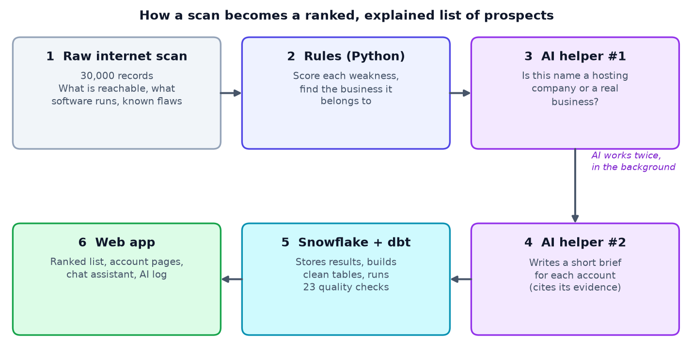

# Architecture

## How the pieces fit

A 30,000-record scan sample is scored and attributed by Python rules (`app/backend/pipeline`). Where no business domain was seen, a small model decides whether the organization name is a hosting company or a real business. A larger model then writes one cited brief per account, offline. Results are loaded into Snowflake (`RAW`), dbt builds staging views, one intermediate view (tiers and rank) and two mart tables under 23 tests, and a Next.js app on Vercel reads the marts. Only the chat calls a model live. The sample yields **417 accounts** from 477 scored assets.

## Rule versus LLM split

| Job | Rule or LLM | Why |
|---|---|---|
| Score every asset and account | Rules | Stable and explainable; a prompt edit must never reorder a sales list |
| Drop honeypots, and ISP or hosting machines (hostnames that embed the IP address, plus a known-host list) | Rules | Exact and free |
| Business or hosting company, when only an organization name exists | Small LLM, behind two caches | Messy names need judgement |
| Account brief and opening question | Larger LLM; code checks citations and falls back to a safe template | Language is where AI helps, and fabrication risk is highest here |
| Chat: understand the question | Small LLM proposes filters; code validates them against whitelists | The model never writes SQL |
| Chat: fetch accounts | Fixed, parameterised SQL | Safe by construction |
| Chat: write the answer | Larger LLM, only over the returned rows | Grounded and refusable |

The rule: **rules decide anything that changes a ranking; the LLM is used only for judgement or language, and never sets a score.**

## Key decisions and trade-offs

1. **Score first, attribute second.** The only step that can cost an LLM call runs on records that already have findings, cutting model calls by about 70%.
2. **Briefs are generated offline, once per account,** resumable and keyed by findings and prompt version. Pages never wait on a model and cost is accounts times one call. The trade-off is that briefs go stale until regenerated.
3. **One LLM client for every call** (`llm_client.py`): Gemini, Groq or Anthropic behind one interface, retries with backoff, per-provider throttling, JSON validation, and a trace of every request and response with provider, model, prompt version, latency, tokens and cost. It is more code, but it is what makes evals, cost and debugging possible.
4. **Prompts and skills are versioned files** (`prompts/<skill>/vN.md`, `skills/*/SKILL.md`). A new version becomes the default only if its eval improves.
5. **Chat safety.** The model proposes filters; code validates them; fixed SQL runs; the answer may use only the returned rows; input is capped and rate limited (in serverless this is a speed bump, not a guarantee).
6. **Snowflake and dbt in layers.** RAW as loaded, STAGING tidy, ANALYTICS marts read by the app, and the tier thresholds in one dbt model.
7. **Free tiers throughout** (Gemini, Groq, Vercel, a Snowflake trial), so building cost $0.

## Evals and traces

| Skill | Labelled set | Measures | v1 to v2 |
|---|---|---|---|
| org_classification | 25 hand-labelled names | Accuracy, precision and recall per class | 80% to 92% |
| risk_narrative | 23 real accounts | Citation validity, top-finding coverage, invented CVEs or ports, unsupported claims, perspective | Unsupported claims 56.5% to 100%; perspective 78.3% to 100% |
| chat_assistant | 12 fixed questions | Correct filters, no invented accounts or CVEs, refuses off-topic | All checks pass |

Every harness bypasses caches, saves `results/<version>_<provider>_<model>.json` and can diff against an earlier run. Every LLM call is logged in full; the Traces page filters by skill, prompt version, provider, model and status and compares v1 with v2.

## Cost model (tokens x volume x frequency)

Cost per call = (input tokens x input price + output tokens x output price) / 1,000,000, using tokens measured from the trace log and published prices.

| Task | Model | Tokens in / out | Cost per call |
|---|---|---|---|
| Organization classification | small tier (gemini-3.5-flash-lite) | 371 / 40 | $0.00021 |
| Sales brief | writing tier (gemini-3.1-flash-lite) | 531 / 101 | $0.00028 |
| Sales brief | writing tier (gemini-3.5-flash-lite) | 562 / 136 | $0.00051 |
| Chat question (2 calls, estimate) | flash-lite | about 1,500 / 300 | about $0.0024 |

**Model choice per task:** a cheap small model for the narrow classification decision, a stronger one for writing, where invented facts matter. On the free tier both map to flash-lite models because larger free models have tiny quotas; in production the writing tier would move to a stronger model.

**This dataset:** about $0.25 at paid rates; **billed $0** on free tiers. The Traces page shows both numbers.

**Production estimate** (a daily scan of this size, 20% new organization names a day, 500 chat questions a day): briefs 417 x $0.00051 = $0.21, classification about 45 x $0.00021 = $0.01, chat 500 x $0.0024 = $1.20, so about **$1.40 a day, $43 a month**. **Ceiling: $60 a month,** with a hard stop if one day passes 3x expected (about $4.30). Every trace record carries its cost, so the check is a sum over one day.

## Known limitations

- One snapshot: no trend claims anywhere.
- The score measures need, not fit or intent, and every CVE counts the same 40 points (CVSS severity is in the data but unused).
- A few ISP or hosting names can remain (for example megared.net.mx) when their machine names do not contain the IP.
- Evals are small, v2 prompts were written after seeing v1's failures on the same sets, and the brief check is keyword-based; a held-out set and an LLM judge are next.
- Chat prompts live in code, and chat calls are logged to Vercel's runtime logs rather than the trace file.
- The Snowflake trial ends around mid-October 2026, and free LLM tiers have daily caps.
