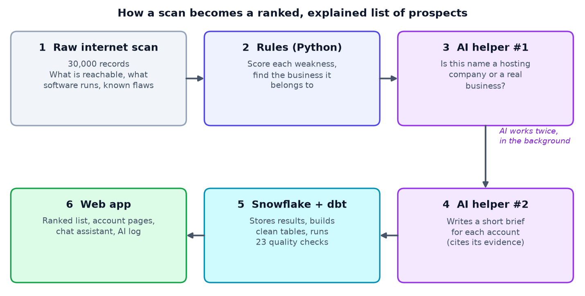
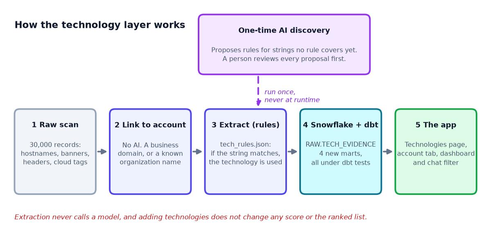

# Architecture

## How the pieces fit

A 30,000-record scan sample is scored and attributed by Python rules (`app/backend/pipeline`). Where no business domain was seen, a small model decides whether the organization name is a hosting company or a real business. A larger model then writes one cited brief per account, offline. Results are loaded into Snowflake (`RAW`), dbt builds staging views, one intermediate view (tiers and rank) and mart tables under 47 tests, and a Next.js app on Vercel reads the marts. Only the chat calls a model live. The sample yields **368 ranked accounts** from 422 scored assets.

A second, separate path reads **which technologies each account runs** (cloud, web server, CDN, frameworks, operating system) from the same scan. It covers every account where the scan showed a business website, **1,987 accounts, 1,656 of which have no security findings** and so are not in the ranked list. It adds its own tables and pages; the scoring, the ranked list and their tests are untouched by it.

## Rule versus LLM split

| Job | Rule or LLM | Why |
|---|---|---|
| Score every asset and account | Rules | Stable and explainable; a prompt edit must never reorder a sales list |
| Drop honeypots, junk domains, and ISP or hosting machines (hostnames that embed the IP address, a provider's own domain, a known-host list) | Rules | Exact and free |
| Tier and rank (a name-only match is capped at HIGH; rank is tier first, then score) | Rules, in dbt | Visible, tested business logic |
| Business or hosting company, when only an organization name exists | Small LLM, behind two caches | Messy names need judgement |
| Account brief and opening question | Larger LLM; code checks citations and falls back to a safe template | Language is where AI helps, and fabrication risk is highest here |
| Which technologies an account runs | Rules (`tech_rules.json`) | Exact, repeatable, free to run on every refresh |
| Proposing those rules for strings no rule covers | LLM, once, then a person reviews | Judgement over a long tail of odd names; never at runtime |
| Chat: understand the question | Small LLM proposes filters; code validates them against whitelists | The model never writes SQL |
| Chat: fetch accounts | Fixed, parameterised SQL | Safe by construction |
| Chat: write the answer | Larger LLM, only over the returned rows | Grounded and refusable |

The rule: **rules decide anything that changes a ranking or states a fact; the LLM is used only for judgement or language, and never sets a score.**

## Key decisions and trade-offs

1. **Score first, attribute second.** The only step that can cost an LLM call runs on records that already have findings, cutting model calls by about 70%. The trade-off is that records with no finding never become accounts, which is why the technology layer links records to accounts separately.
2. **Briefs are generated offline, once per account,** resumable and keyed by findings and prompt version. Pages never wait on a model and cost is accounts times one call. The trade-off is that briefs go stale until regenerated.
3. **One LLM client for every call** (`llm_client.py`): Gemini, Groq or Anthropic behind one interface, retries with backoff, per-provider throttling, JSON validation, and a trace of every request and response with provider, model, prompt version, latency, tokens and cost.
4. **Prompts and skills are versioned files** (`prompts/<skill>/vN.md`, `skills/*/SKILL.md`). A new version becomes the default only if its eval improves.
5. **Attribution fixed by reading the data, not by a longer blocklist.** Providers name machines after the IP address, so a domain seen only under such names is the provider's, not a customer's. A domain named after a hosting business that operates the IP space is its own site. An organization on a cloud IP range names the range holder, not the tenant. This removed about 150 ISP and hosting accounts in total. The trade-off is that a few ISPs remain (see limitations).
6. **A name-only match can never be CRITICAL.** Evidence that rests on an organization name alone is weaker, so its score is also counted at 70% and the tier is capped at HIGH.
7. **Technology extraction is rules with a one-time LLM discovery pass.** The model proposed 274 rules for strings no rule covered; a person reviewed them and rejected or corrected 36 (for example `duo-api`, which is Duolingo's own server and not Duo Security). After that, extraction needs no model. Trade-off: rules cover only what the scan shows and only what has been discovered, so coverage is reported rather than assumed.
8. **Star-schema evidence.** Evidence rows carry only the technology name; category and vendor live in a small catalog table that dbt joins. Marts are rebuilt in dbt, not in Python.
9. **Chat safety.** The model proposes filters (now including a technology); code validates them against whitelists; fixed SQL runs; the answer may use only the returned rows; input is capped and rate limited (in serverless this is a speed bump, not a guarantee).
10. **Quality gates.** 35 unit tests, 47 dbt tests and a type check run in GitHub CI on every push. The AI evals use real models and free-tier quota, so they are run by hand.
11. **Free tiers throughout** (Gemini, Groq, Vercel, a Snowflake student trial), so building cost $0.

## Evals and traces

| Skill | Labelled set | Measures | Result |
|---|---|---|---|
| org_classification | 25 labelled names | Accuracy, precision and recall per class | v1 80%, v2 92% |
| risk_narrative | 23 real accounts | Citation validity, top-finding coverage, invented CVEs or ports, unsupported claims, perspective | Unsupported claims 56.5% to 100%; perspective 78.3% to 100% |
| chat_assistant | 16 fixed questions | Correct filters (including technology), no invented accounts or CVEs, empty answers when nothing matches, refuses off-topic | All checks pass |
| technology_extraction | 38 labelled records | Precision, recall, versions, records fully right | Seed rules F1 95.2%; with reviewed discovered rules 99.4% (recall 90.9% to 98.9%, precision 100%); after a banner rule for WordPress, 100% on the 38 records |

Every harness saves its results and can diff against an earlier run. The extraction eval needs no model: it is free and runs in about a second. Every LLM call is logged in full; the Traces page filters by skill, prompt version, provider, model and status and compares versions.

## Cost model (tokens x volume x frequency)

Cost per call = (input tokens x input price + output tokens x output price) / 1,000,000, using tokens measured from the trace log and published prices.

| Task | Model | Tokens in / out | Cost per call |
|---|---|---|---|
| Organization classification | small tier (gemini-3.5-flash-lite) | 371 / 40 | $0.00021 |
| Sales brief | writing tier (gemini-3.1-flash-lite) | 531 / 101 | $0.00028 |
| Sales brief | writing tier (gemini-3.5-flash-lite) | 562 / 136 | $0.00051 |
| Chat question (2 calls, estimate) | flash-lite | about 1,500 / 300 | about $0.0024 |
| Technology discovery (one time, 9 calls) | writing tier | batches of 40 strings | about $0.04 in total |

**Model choice per task:** a cheap small model for the narrow classification decision, a stronger one for writing and for the one-time discovery, where wrong facts matter. On the free tier both map to flash-lite models because larger free models have tiny quotas; in production the writing tier would move to a stronger model.

**This dataset:** about $0.25 at paid rates; **billed $0** on free tiers. All 1,903 calls logged while building, including re-runs and evaluations, come to $0.41 at paid rates. The Traces page shows both numbers.

**Production estimate** (a daily scan of this size, 20% new organization names a day, 500 chat questions a day): briefs 368 x $0.00051 = $0.19, classification about 45 x $0.00021 = $0.01, chat 500 x $0.0024 = $1.20, so about **$1.40 a day, $42 a month**. Technology extraction adds no model cost. **Ceiling: $60 a month,** with a hard stop if one day passes 3x expected (about $4.20). Every trace record carries its cost, so the check is a sum over one day.

## Known limitations

- One snapshot: no trend claims anywhere.
- The score measures need, not fit or intent, and every CVE counts the same 40 points (CVSS severity is in the data but unused).
- About 43% of accounts have an unknown hosting role. The label is explanatory only and never affects inclusion or score; it is set from the scan's own cloud and hosting evidence rather than guessed.
- A few ISP or hosting names can remain (for example `shawcable.net`) when their machine names do not embed the IP and no keyword gives them away.
- Technologies are only what the scan happened to show for each account, in one snapshot. WordPress seen only in a `Link: wp-json` header is now found by a banner rule (21 to 72 scan records), but other banner-only signals are not read.
- Evals are small, v2 prompts were written after seeing v1's failures on the same sets, and the brief check is keyword-based. The extraction labels were a first pass written by reading banners and hostnames; the scanner already parsed most fields, so that score mostly guards normalization, versions and false positives.
- Chat prompts live in code, and chat calls are logged to Vercel's runtime logs rather than the trace file.
- The Snowflake account is a 120-day student trial; check its expiry date in Snowflake before relying on the live app after that. Free LLM tiers have daily caps.
